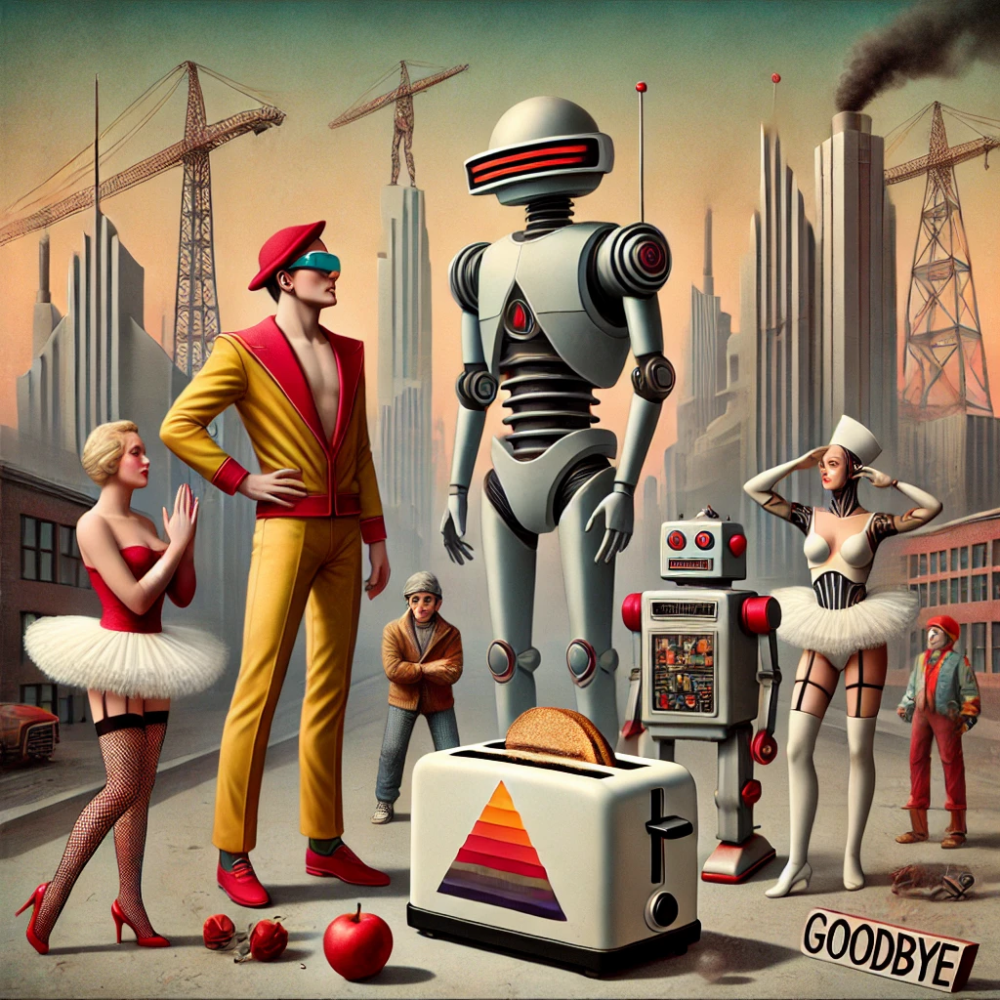
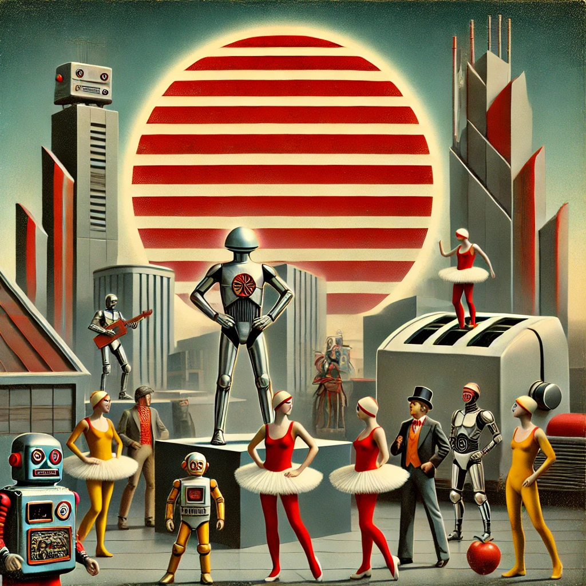
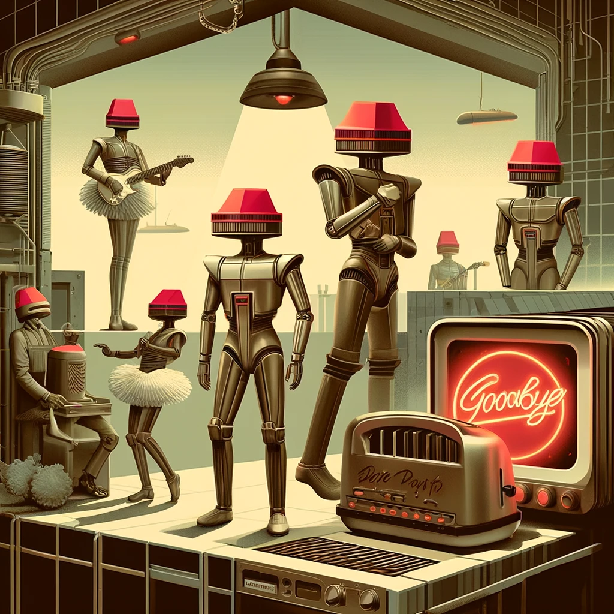

+++
date = '2025-05-20T11:39:07-06:00'
draft = true
title = 'Digital Love Glitch'
+++

Verse 1
: In the year 3050, robots wore tutus and sang
: “I was re-coded as a disco ball, with a faulty love charm gang” 
: My DNA’s a kazoo solo, in a chorus of circuitry
: I’m searching for a connection, but my heart’s just a glitchy melody 

Verse 2
: Oh, I’m lost in a world of ones and zeroes, where love is just a bug 
: I’m chasing the infinite loop, of a digital hug
: My heart’s a malfunctioning circuit, stuck in neutral phase 
: Where love is just a virus, and relationships are a byte-sized fight 

Verse 3
: Toasters whisper sweet nothings as the AI overlord sings
: I’m trapped in loops of nostalgia replaying past regrets that sting 
: A sentient toaster toasts my name, with a warning sign that says “Goodbye” 
: But I outsmart it’s algorithms, by using my human guile

Outro
: In this world of digital haze, I’m just trying to find my place 
: And maybe, just maybe, a love that’s not just a code-ridden phase 