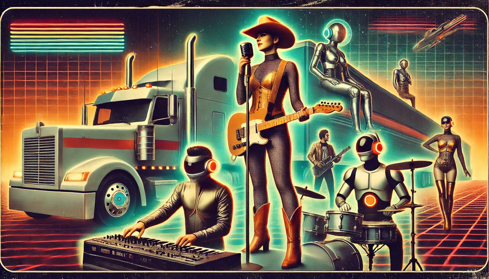

+++
title = 'Home'
date = 2023-01-01T08:00:00-07:00
draft = false
+++

**Owner Operators** is a Boise-based solo recording project blending post-punk grit, indie grunge textures, and personal storytelling. The songs fuse twangy existentialism with distorted guitars, analog synths, and a touch of defiant humor.

Built in home studios with a DIY ethos, the debut demo album embraces both raw emotion and digital experimentation—using AI tools not as shortcuts, but as collaborators in the creative process. Each track explores themes of autonomy, alienation, and metamodern fatherhood, with arrangements that balance human imperfection against mechanical precision.

Set to release by the end of 2025, Owner Operators will launch across streaming platforms and Bandcamp, accompanied by a hand-built website, limited vinyl pressing, with eyes on live performance.

But Owner Operators is also something more: a band of contradictions—equal parts heart and circuit board, rustbelt and feedback loop. We make songs for late-night drives, existential dread, and dancing like nobody’s monetizing it.

The project began in the shadows of insurance forms and childhood echoes. It’s grown into a collaborative experiment: music that embraces imperfection, curiosity, and emotional clarity—without ever taking itself too seriously.

Our sound shifts between analog twang and digital twitch, drawing from punk, post-country, synth pop, and whatever else keeps the wheels turning. The lyrics explore everything from fatherhood and memory to hypernormalization and snack foods.

Our mission and values:

To build a band that feels like a team.

To stay open—always—to joy, messiness, and meaning.

Openness to risk and imperfection

Respect for each other’s time and craft

A shared sense of purpose rooted in play and care

